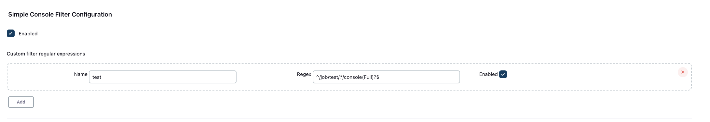

Console Filter Plugin
===============================

This plugin allows filtering Jenkins console output by means of regular expressions. It will filter '[Pipeline]' lines

```
</span><span class="pipeline-new-node" nodeid="4" startid="4" enclosingid="3">[Pipeline] {<span class="pipeline-show-hide"> (<a href="#" onclick="showHidePipelineSection(this); return false">hide</a>)</span>
</span><span class="pipeline-new-node" nodeid="6" startid="6" enclosingid="5">[Pipeline] {<span class="pipeline-show-hide"> (<a href="#" onclick="showHidePipelineSection(this); return false">hide</a>)</span>
</span><span class="pipeline-new-node" nodeid="5" startid="5" enclosingid="4">[Pipeline] timeout<span class="pipeline-show-hide"> (<a href="#" onclick="showHidePipelineSection(this); return false">hide</a>)</span>
```
any page ending with /console or /consoleFull if the pipeline is complete. It does not filter currently running pipelines.

To disable the filtering, just uncheck the "Enable" checkbox in the settings.

# Configuring the plugin

Note that the filtering is applied to all projects.

## Global configuration


## Unfiltered


## Filtered


# Usage

To enable the console log file filter simply:

- Go to http://JENKINS/manage/configure
- Go to Simple Console Filter Configuration
- Check Enabled
- Click Save

The default regular expression is
```
/.*/console(Full)?$
```
and is applied globally.

If you add your own regular expressions they will replace the default.

To add your own regular expressions:
- Click Add
- Add a name, regex and choose to enable
- Click Save
